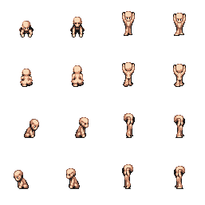

# Types of Animations

Currently `bevy_animations` has 5 different types of animations with their own properties and use cases.

The idea behind having multiple animations to choose from is having some freedom of control.

The types of animations are:

* [TimedAnimation](https://docs.rs/bevy_animations/latest/bevy_animations/struct.TimedAnimation.html)
* [TransformAnimation](https://docs.rs/bevy_animations/latest/bevy_animations/struct.TransformAnimation.html)
* [LinearTimedAnimation](https://docs.rs/bevy_animations/latest/bevy_animations/struct.LinearTimedAnimation.html)
* [LinearTranformAnimation](https://docs.rs/bevy_animations/latest/bevy_animations/struct.LinearTransformAnimation.html)
* [SingleFrameAnimation](https://docs.rs/bevy_animations/latest/bevy_animations/struct.SingleFrameAnimation.html)

## Shared properties

There are some common similarities between each animation. All or most animations shares these properties,

* `AnimationName` is a `&'static str` and should be unique to the animation it's defined on.
* `frame` is a `Vec2` where x is the number of columns and y is the number of rows in the sprite sheet.
* `direction_indexes` is an enum which defines the direction indexes of the animation.



For this sprite sheet the `AnimationName` might be `player_lifting`.

The `frame` would be `Vec2::new(4.0, 4.0)`.

And the `direction_indexes` would be:

```rust
AnimationDirectionIndexes::IndexBased(IndexBasedDirection {
    left: 3,
    right: 2,
    up: 1,
    down: 0
})
```

There are also some other config properties which are common. These are

* `blocking` is a `bool` to determine if the animation should block others from happening when it's active
* `blocking_priority` is an `i32` which will be used to determine the priority at which and animation should block other blocking animations. For example, lets say there are three animations on a player `player_pickup`, `player_idle`, and `player_die`. `player_pickup` will have a blocking priority of `1`, `player_idle` will have a blocking priority of `0`, and `player_die` will have a blocking priority of `2`. In this example `player_pickup` can prevent `player_idle` from happening but not `player_die`. So if the `player_die` animation is started whilst `player_pickup` is playing, it will start and prevent the `player_pickup` animation from playing again. And if the `player_idle` animation is trying to be started while the `player_pickup` animation is happening it won't start.

Each animation has its own unique configuration properties that will be explained with each animation. These are just the common ones to learn.

## [Continue To Next Chapter ->](./chapter_5.md)
